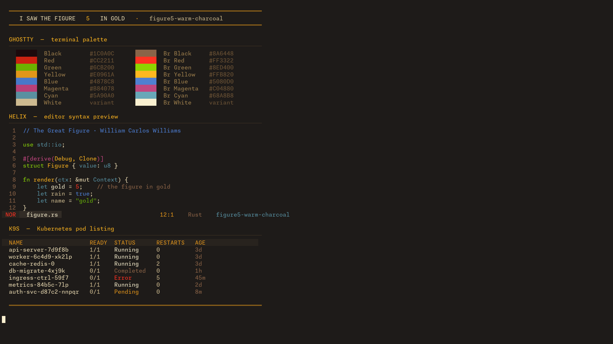
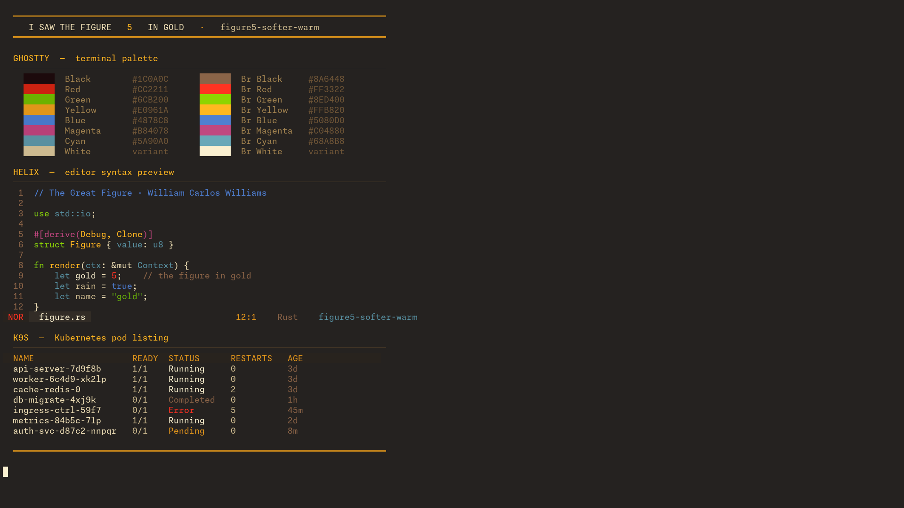
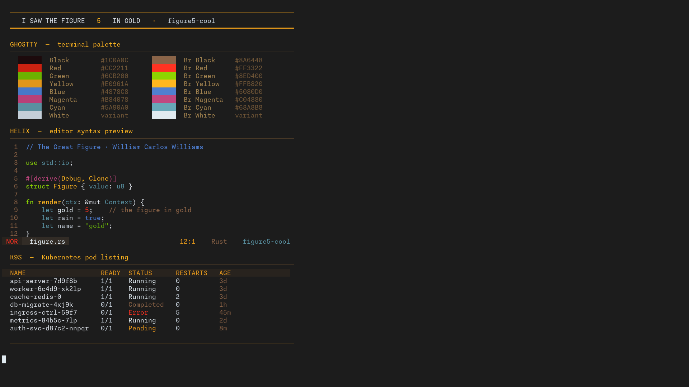

# Figure 5

> **Personal project.** This theme was built for my own use and generated with AI assistance. I don't expect anyone else to use it.

A dark terminal and editor colour theme inspired by Charles Demuth's 1928 painting
*I Saw the Figure 5 in Gold*. Designed with red/green colour blindness in mind —
greens are shifted to yellow-green (~85° hue) to stay distinguishable from red.

Three variants are provided — two warm, one cool:

| Variant | Background | Character |
|---|---|---|
| `figure5-warm-charcoal` | `#1E1B19` | Very dark, faint warm undertone |
| `figure5-softer-warm` | `#252220` | Slightly lighter, warmest of the three |
| `figure5-cool` | `#1C1C1C` | Pure neutral grey, cool blue-grey whites |

## Palette

The warm and cool variants share all accent colours. Only the background and whites differ.

### Shared

| Role | Hex |
|---|---|
| Foreground (warm) | `#F0E0B8` |
| Foreground (cool) | `#D8DDE4` |
| Selection | `#401818` |
| Black / Bright Black | `#1C0A0C` / `#8A6448` |
| Red / Bright Red | `#CC2211` / `#FF3322` |
| Green / Bright Green | `#6CB200` / `#8ED400` |
| Yellow / Bright Yellow | `#E0961A` / `#FFB820` |
| Blue / Bright Blue | `#4878C8` / `#5080D0` |
| Magenta / Bright Magenta | `#B84078` / `#C04880` |
| Cyan / Bright Cyan | `#5A90A0` / `#68A8B8` |

### Per-variant

| Role | Warm variants | Cool variant |
|---|---|---|
| Cursor | `#FAF0D0` | `#E0EAF0` |
| White | `#CDBA90` | `#C4CED8` |
| Bright White | `#FAF0D0` | `#E0EAF0` |

## Screenshots

### Warm Charcoal


### Softer Warm


### Cool


## Preview

```sh
make preview       # warm variants
make preview-cool  # cool variant
make showcase      # full showcase (palette + Helix + k9s)
make screenshot    # regenerate screenshots
```

## Installation

```sh
make           # install everything (symlinks by default, except vscode/cursor which always copy)
make ghostty
make zed
make helix
make k9s
make vscode
make cursor

make INSTALL_METHOD=copy   # copy files instead of symlinking (ghostty/zed/helix/k9s)
```

### Ghostty

Symlinks (or copies) themes to `~/.config/ghostty/themes/`. Then set in `~/.config/ghostty/config`:

```
theme = figure5-warm-charcoal
# or: figure5-softer-warm, figure5-cool
```

### Zed

Symlinks (or copies) `zed/figure5.json` to `~/.config/zed/themes/`. Then set in `~/.config/zed/settings.json`:

```json
"theme": "Figure 5 – Warm Charcoal"
// or: "Figure 5 – Softer Warm", "Figure 5 – Cool"
```

Or open the theme picker (`Ctrl+K Ctrl+T`) and search for "Figure 5".

### Helix

Symlinks (or copies) `.toml` files to `~/.config/helix/themes/`. Then set in `~/.config/helix/config.toml`:

```toml
theme = "figure5-warm-charcoal"
# or: figure5-softer-warm, figure5-cool
```

### k9s

Symlinks (or copies) `.yaml` files to `~/.config/k9s/skins/`. Then set in `~/.config/k9s/config.yaml`:

```yaml
k9s:
  ui:
    skin: figure5-warm-charcoal
```

### VSCode / Cursor

Copies the extension to `~/.vscode/extensions/figure5-theme-1.0.0/` (or `~/.cursor/extensions/`).
VSCode and Cursor don't support symlinked extensions, so this always copies.

```sh
make vscode   # installs to ~/.vscode/extensions/
make cursor   # installs to ~/.cursor/extensions/
```

Then open the theme picker (`Ctrl+K Ctrl+T`) and search for "Figure 5", or set in `settings.json`:

```json
"workbench.colorTheme": "Figure 5 – Warm Charcoal"
// or: "Figure 5 – Softer Warm", "Figure 5 – Cool"
```

Reload the window after installing (`Ctrl+Shift+P` → "Developer: Reload Window").

### Slack

No installable file. Go to **Preferences > Themes > Custom Theme** and paste a colour string from `slack/figure5.txt`.
